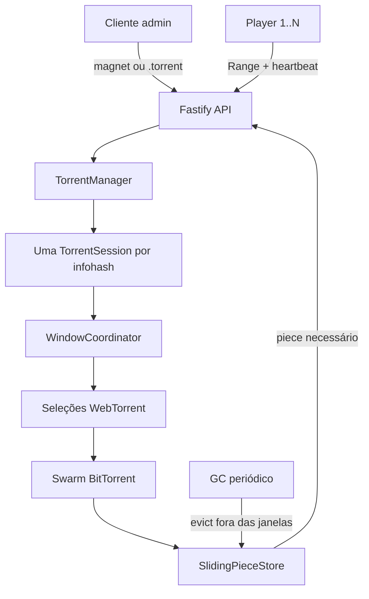

# Arquitetura e invariantes

## Componentes



## Uma sessão por infohash

`TorrentManager` deduplica magnet/arquivo pelo infohash. Todos os playbacks desse torrent compartilham peers, bitfield, cache e velocidades. Isso é a base do suporte a mais de um espectador dentro de uma única instância.

O projeto não faz coordenação distribuída. Rodar duas réplicas cria dois clientes BitTorrent independentes, e uma URL de playback criada por uma réplica pode cair na outra. Para escalar horizontalmente seria necessário armazenamento/estado compartilhado ou afinidade de sessão, além de redesenhar o cache.

## Coordenador de janelas

Há duas fontes de janela:

- heartbeat do player, estimado proporcionalmente por `currentTime / duration`;
- cursor real de cada resposta HTTP em andamento.

O cursor HTTP é autoritativo enquanto o stream está aberto. O heartbeat ajuda o swarm a antecipar o próximo intervalo e manter o buffer durante pausa/seek. Intervalos sobrepostos de viewers diferentes são mesclados antes de chamar `torrent.select()`.

## Store por piece

Um chunk store convencional tende a representar o torrent como arquivos finais. Remover um intervalo verificado desse layout sem invalidar o bitfield pode fazer o cliente acreditar que bytes inexistentes ainda estão disponíveis.

`SlidingPieceStore` guarda cada piece em um arquivo atômico separado:

```text
/tmp/torrent-window-gateway/<session-id>/pieces/
  00000000.piece
  00000001.piece
  000000a4.piece
```

Antes de excluir um piece, a sessão:

1. cria um tombstone para bloquear novas leituras;
2. chama `_markUnverified(index)` para limpar o estado verificado do WebTorrent;
3. envia `lt_donthave` a wires que negociaram BEP 54;
4. remove o arquivo do piece;
5. deixa a seleção ativa baixá-lo novamente se ele voltar a ser necessário.

O pacote fixa `webtorrent@3.0.21`. `_markUnverified`, `_selections` e `_updateSelections` são APIs internas; a sessão falha de modo explícito se o contrato esperado não estiver presente. Não atualize WebTorrent sem revisar esses pontos e executar testes de integração.

`bittorrent-tracker` também importa antecipadamente o parser de seu servidor opcional, embora este projeto use somente o cliente. Esse parser depende do pacote `ip`, cujo classificador público/privado não possui correção para CVE-2024-29415. O override em `vendor/ip-safe` expõe exclusivamente o formatador `toString` realmente referenciado pelo parser e remove as rotinas vulneráveis; o gateway nunca instancia um tracker server.

## Coleta de lixo

O GC roda a cada `GC_INTERVAL_SECONDS` e respeita esta ordem:

1. peças fora de todas as janelas por mais que o período de graça;
2. LRU fora de janela quando um torrent supera seu teto;
3. LRU global fora de janela quando o processo supera seu teto.

Pieces protegidos não são removidos, mesmo acima do limite. Assim, os limites são de melhor esforço: a correção do stream tem precedência, e muitas janelas afastadas podem ultrapassar temporariamente o orçamento.

## Ciclo de uma requisição Range

1. valida admin ou token de playback;
2. valida um único intervalo `bytes=start-end`;
3. reserva um slot global e da reprodução;
4. cria uma janela temporária e aguarda o primeiro piece;
5. só então envia os headers `200`/`206`;
6. o `Readable` avança piece a piece, atualizando seu cursor;
7. abort/close remove a janela e libera o slot de forma idempotente.

O preflight evita responder `206` e depois descobrir, antes de qualquer byte, que o primeiro piece não chegou. Uma indisponibilidade posterior ainda encerra o stream; o navegador pode tentar uma nova requisição Range.

## Segurança

- endpoints de controle e observabilidade: `API_KEY`;
- playback: token aleatório de 256 bits armazenado somente como SHA-256;
- expiração por ociosidade e vida máxima;
- limites por IP e globais;
- query strings omitidas do log da aplicação;
- trackers/webseeds filtrados por protocolo, DNS e blocos IP privados/reservados;
- peers inbound/outbound em endereços locais, privados ou reservados bloqueados no cliente;
- webseeds e upload desativados por padrão;
- CSP, `no-referrer`, `nosniff`, CORS configurável e iframe `frame-ancestors` configurável.

DNS rebinding e redirects de tracker são riscos que também dependem do comportamento das bibliotecas subjacentes e da rede do provedor. Para um serviço exposto a usuários não confiáveis, adicione egress filtering no nível da infraestrutura.

## Decisões para 512 MB

- disco para pieces; RAM fica com buffers pequenos;
- `storeCacheSlots: 0`, evitando cache duplicado de pieces na memória;
- sem FFmpeg, HLS ou análise completa de mídia;
- conexões, torrents, streams e playback limitados;
- chunk HTTP de 256 KiB;
- uma única instância e estado efêmero.

## O que seria necessário para produção maior

- fila/controle de admissão e quotas por usuário autenticado;
- banco compartilhado e tokens revogáveis;
- observabilidade externa e alertas;
- egress firewall e política de trackers;
- object storage ou cache distribuído apropriado;
- afinidade/roteamento entre réplicas;
- workers dedicados para remux/transcode;
- testes de carga, torrents adversariais e fuzzing de Range/metainfo;
- processo formal de atualização das dependências.
